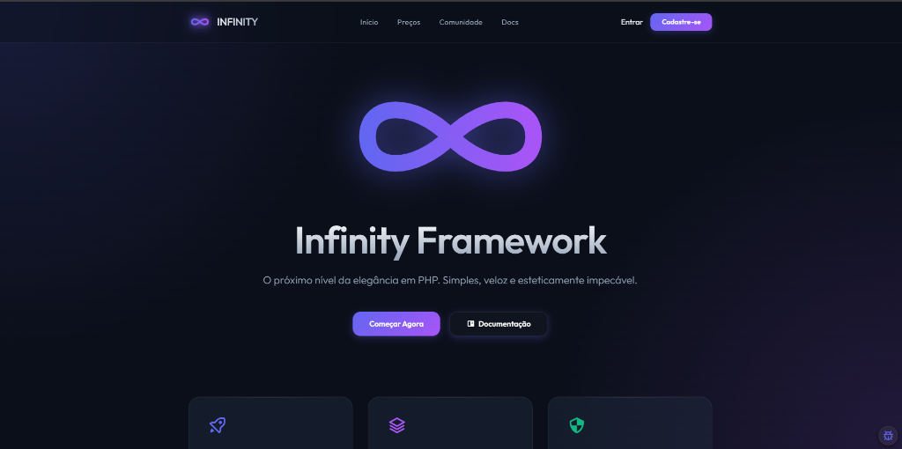
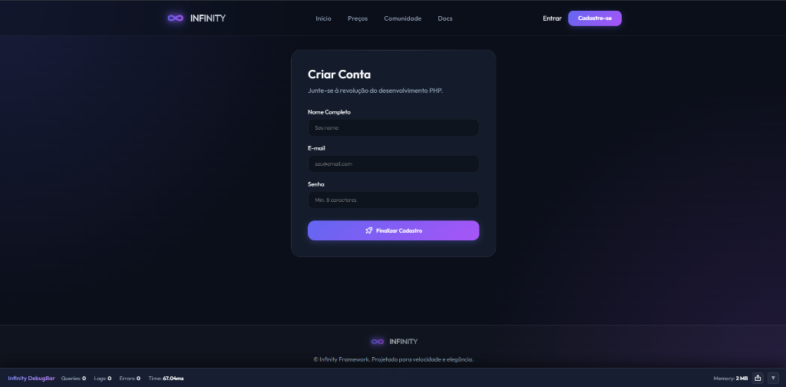
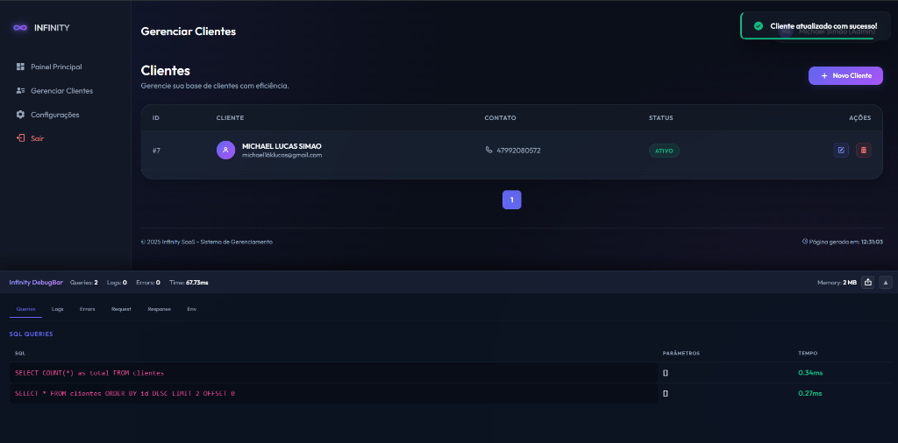
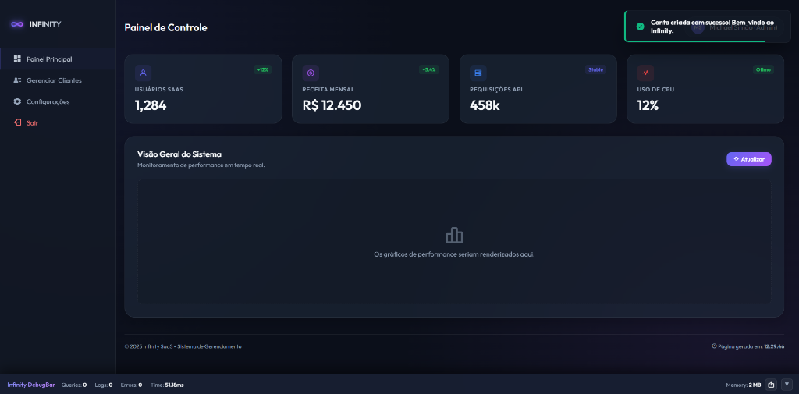
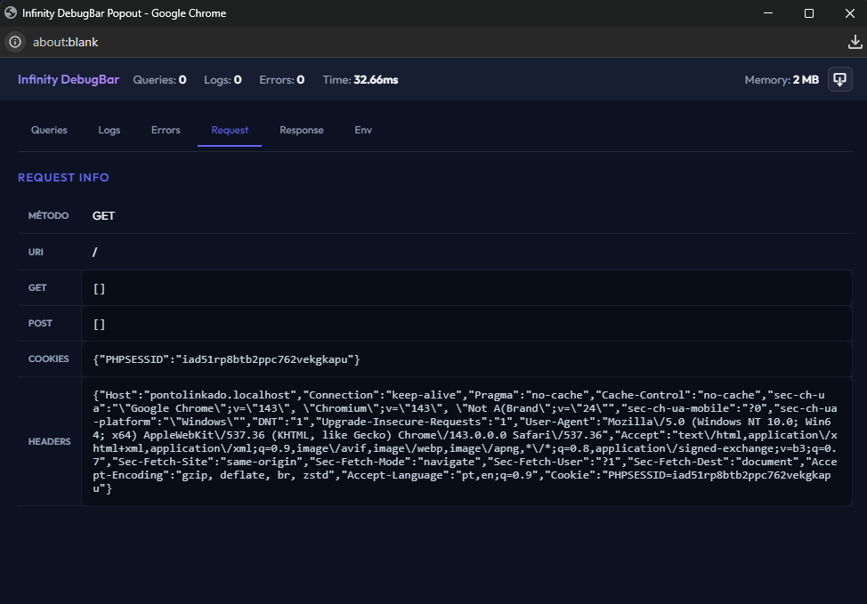
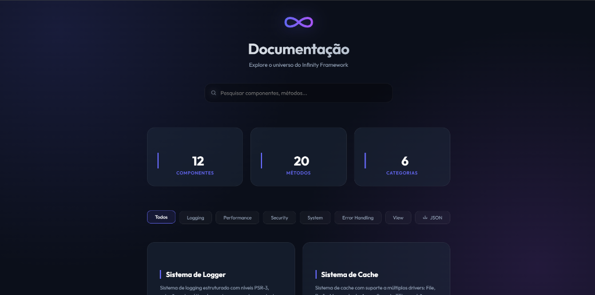

# ♾️ Infinity Framework




### 🇧🇷 Elegância, Velocidade e Simplicidade. O Framework PHP que o Brasil merece.

O **Infinity Framework** foi projetado para desenvolvedores que valorizam estética e performance. Com uma arquitetura leve, ele entrega uma experiência de codificação fluida sem a sobrecarga de frameworks gigantescos.

---

## 📸 Galeria

| Login (Glass) | Home (Showcase) | Clientes (CRUD) |
|:---:|:---:|:---:|
|  |  |  |

---

## ✨ Destaques



-   🚀 **Performance Extrema:** Núcleo minimalista otimizado para baixíssima latência.
-   🎨 **Design Premium:** Layouts modernos com tema dark e estética Glassmorphism por padrão.
-   🔎 **Debug Bar Elite:** Uma barra de depuração poderosa que desacopla em janela separada, rastreia Queries SQL e Logs em tempo real.
-   📦 **Storage Flexível:** Suporte nativo para Local e Amazon S3 pronto para produção.
-   🗂️ **Arquitetura MVC:** Separação clara de responsabilidades para projetos escaláveis.
-   🔐 **Segurança Integrada:** Middlewares de autenticação e proteção de rotas simplificados.

---

## 🐞 Power Debugging



O Infinity conta com a **Infinity DebugBar**, uma ferramenta indispensável para o desenvolvimento:
-   **Desacoplamento:** Clique em "Popout" para mover o debug para um segundo monitor.
-   **Live Sync:** Dados de SQL e Logs são atualizados instantaneamente conforme você navega na aplicação.
-   **Memory Peak:** Monitore o consumo exato de memória de cada rota.

---

## 📖 Documentação Offline-First



Diferente de outros frameworks que dependem de sites externos ou conexão constante, o Infinity traz a **documentação completa embutida**.

Ao navegar para a rota `/docs` na sua aplicação local, você terá acesso a um sistema de documentação rico (estilo Aurora), rápido e que funciona **100% offline**. Isso é a nossa "fonte da verdade" — guias sobre roteamento, controllers, banco de dados e muito mais, sempre à mão para te guiar.

---

## 🛠️ Tecnologias

-   **Backend:** PHP 8.1+
-   **Arquitetura:** MVC (Model, View, Controller)
-   **Frontend:** HTML5, CSS3 (Vanilla), JavaScript
-   **Ícones:** Boxicons
-   **Fonts:** Outfit Google Fonts

---

## 🚀 Começando Agora

### 1. Requisitos
-   PHP 8.1 ou superior
-   Extensão MySQL
-   XAMPP / Laragon ou Apache com mod_reveal habilitado

### 2. Instalação
Clone o repositório no seu servidor local:
```bash
git clone https://github.com/michaelklucas/Infinity.git
```

### 3. Configuração
Renomeie o arquivo `exemple.env` para `.env` e configure suas variáveis de ambiente:
```env
# Aplicação
URL=http://localhost/infinity
NAME_APP="Infinity Framework"
JWT=
APP_DEBUG=true
APP_DOCS=true
MAINTENANCE=false

# Banco de Dados
DB_HOST=localhost
DB_NAME=infinity_db
DB_USER=root
DB_PASS=
DB_PORT=3306

# E-mail (SMTP)
MAIL_HOST=smtp.mailtrap.io
MAIL_PORT=2525
MAIL_USERNAME=
MAIL_PASSWORD=
MAIL_FROM_NAME="Infinity Framework"
MAIL_FROM_EMAIL=no-reply@infinity.com
MAIL_SECURE=tls

# Cache & Redis
CACHE_DRIVER=file
CACHE_TIME=120
CACHE_DIR=app/Cache
REDIS_HOST=127.0.0.1
REDIS_PORT=6379
REDIS_PASS=

# Storage (Local ou S3)
STORAGE_DRIVER=local
S3_KEY=
S3_SECRET=
S3_REGION=us-east-1
S3_BUCKET=
S3_ENDPOINT=
```

---

## 🤝 Contribuindo

O Infinity é um projeto de código aberto feito por brasileiros para o mundo. Sinta-se à vontade para abrir Issues ou enviar Pull Requests!

### Créditos
Desenvolvido com ❤️ por [Michael Simão](https://github.com/michaelklucas)

---

## 💝 Doações

Se você gostou do Infinity e deseja apoiar o desenvolvimento e a manutenção do framework, considere fazer uma doação via Pix:

**Chave Pix:** `michael16klucas@gmail.com`

Agradeço imensamente qualquer contribuição — cada apoio ajuda a financiar melhorias, manutenção e novas funcionalidades.

---

<p align="center">
  
</p>
